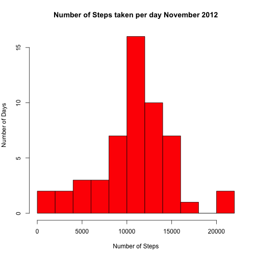
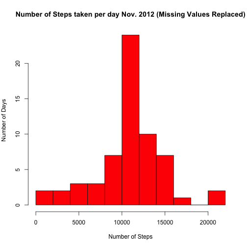
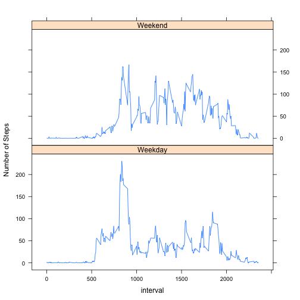

# Reproducible Research: Peer Assessment 1


## Loading and preprocessing the data

```r
setwd("~/Desktop/Data Specialisation/Working Directory")
ds<-read.csv("activity.csv")
ds$date<-as.Date(ds$date,"%Y-%m-%d")
ds$steps<-as.numeric(ds$steps)
ds$interval<-as.factor(ds$interval)
```

## What is mean total number of steps taken per day?
Before I calculate the mean of the total number of steps taken per day, it is worth considering the total steps taken for each day in November.  Representing this as a Histogram informs us of the variation of the steps taken per day.  This can range from as little as a couple hundreds steps to as much as 20,000 steps. 


```r
day.sum<-with(ds, tapply(steps, date, sum)) 
par(mar=c(5,4,4,2))
hist(day.sum,breaks=15,main="Number of Steps taken per day November 2012",xlab="Number of Steps",ylab="Number of Days",col="red")
```

 


```r
mean<- mean(day.sum,na.rm=T)
mean<-format(mean, scientific = FALSE)
median<-median(day.sum,na.rm=T)
median<-format(median, scientific = FALSE)
```
The mean total number of steps taken per day was 10766, while the median was 10765.


## What is the average daily activity pattern?

I wil now turn to the average daily activity pattern.  The number of steps taken over a 5 minute interval is captured throughout the day.  To gain an appreciation of the daily activity over the month I will plot a time series of the average number of steps taken in 5 minute interval averaged accross all days. 


```r
a<-aggregate(steps ~ interval,data = ds,FUN=function(x) mean(x) )
with(a,plot(as.character(interval),steps,xlab="Intervals",ylab="Steps",main="Average Steps per Interval",xaxt="n",type="n"))
axis(1,at = seq(100,2300, by = 100),las=2)
with(a,lines(as.character(interval),steps))
```

 


```r
b<-a[which.max(a$steps),]
b$interval<-as.character(b$interval)
max<-as.numeric(b[1,1])
steps<-b[1,2]
```
The 5 minute interval that contains the maximum number of steps on average is 835.  During this interval the average number of steps taken is 206.1698.  This is also evident on the graph.


## Imputing missing values

```r
na<-sum(is.na(ds$steps))
```
The dataset supplied for analysis contains a 2304 missing values which are reported as "NA" in the column containing the number of steps.

The missing values will be replaced with the mean number of steps for the appropriate 5 minute interval in original dataset where the missing values have been removed.


```r
fill<-ds
new<-aggregate(steps ~ interval,data = ds,FUN=function(x) mean(x) )
new$interval<-as.numeric(new$interval)

for(i in 1:as.numeric(nrow(fill))) {if(is.na(fill[i,1])){
  a<-as.numeric(fill[i,3])
  b<-subset(new,interval==a)
  fill[i,1]<-b[1,2]
}
}
na1<-sum(is.na(fill$steps))
```

After the input of the data, you will notice that we now have 0 "NA"s which can been also be idenified in the head of the new dataset which originally held "NA" values


```r
head(fill)
```

```
##     steps       date interval
## 1 1.71698 2012-10-01        0
## 2 0.33962 2012-10-01        5
## 3 0.13208 2012-10-01       10
## 4 0.15094 2012-10-01       15
## 5 0.07547 2012-10-01       20
## 6 2.09434 2012-10-01       25
```

For the sake of comparison between the original dataset and the new filled dataset I will first produce a histogram of the new data based on the total number of steps taken each day in November. 


```r
day.fill<-with(fill, tapply(steps, date, sum)) 
par(mar=c(5,4,4,2))
hist(day.fill,breaks=15,main="Number of Steps taken per day Nov. 2012 (Missing Values Replaced)",xlab="Number of Steps",ylab="Number of Days",col="red")
```

 

Initial observations suggest that the data follows a similar pattern, but the frequency of days for each sum has increased. This would be as expected given the strategy used for replacing missing values.

```r
meanf<- mean(day.fill)
meanf<-format(meanf, scientific = FALSE)
medianf<-median(day.fill)
medianf<-format(medianf, scientific = FALSE)
```
The mean of the new dataset is 10766 which is the same value as the mean of the original dataset 10766.  

The median of the new dataset is 10766 which is very similar to the median of the original dataset 10765. The difference is only one step.

Given that I replaced the missing values with the mean of the steps for each respective interval; this result appears reasonable.

## Are there differences in activity patterns between weekdays and weekends?


```r
week<-fill
week$day <- weekdays(week$date)

attach(week)
```

```
## The following object is masked _by_ .GlobalEnv:
## 
##     steps
```

```r
week$day[day=="Sunday"] <- "Weekend"
week$day[day=="Saturday"] <- "Weekend"
week$day[day=="Monday"] <- "Weekday"
week$day[day=="Tuesday"] <- "Weekday"
week$day[day=="Wednesday"] <- "Weekday"
week$day[day=="Thursday"] <- "Weekday"
week$day[day=="Friday"] <- "Weekday"
detach(week)

com<-aggregate(steps ~ day+interval,data = week,FUN=function(x) mean(x) )
head(com)
```

```
##       day interval   steps
## 1 Weekday        0 2.25115
## 2 Weekend        0 0.21462
## 3 Weekday        5 0.44528
## 4 Weekend        5 0.04245
## 5 Weekday       10 0.17317
## 6 Weekend       10 0.01651
```

```r
library(lattice)
com$interval<-as.numeric(as.character(com$interval))
xyplot(steps ~ interval | day, data = com,type="l",ylab="Number of Steps",layout=c(1,2))
```

 


In the first instance, I need to identify the day and then change it to two factors: Weekend and Weekday.  Once this is achieved, I need ot find the mean number of steps taken per interval over the month.

